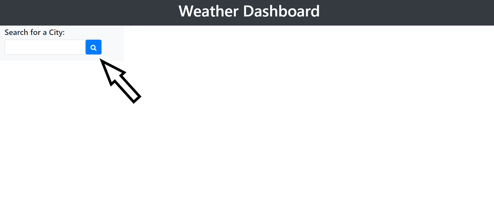
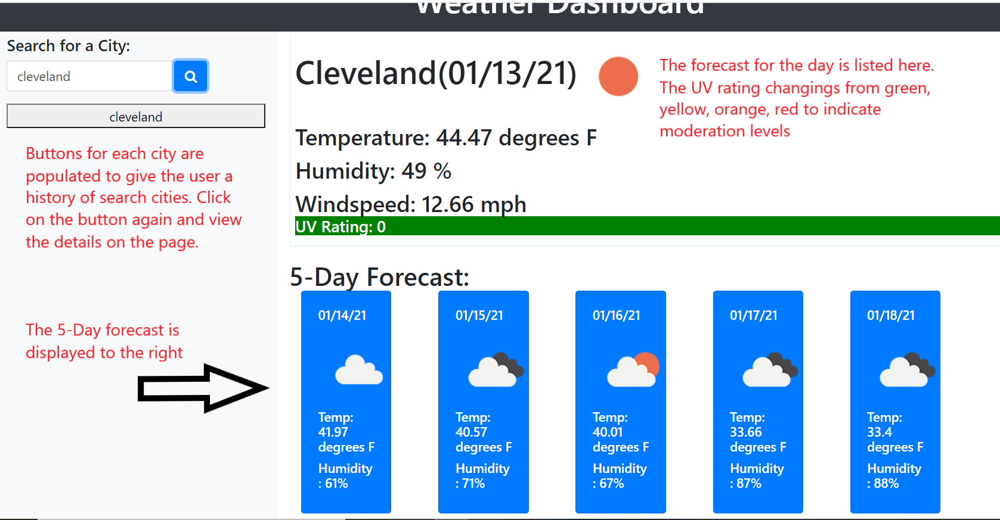
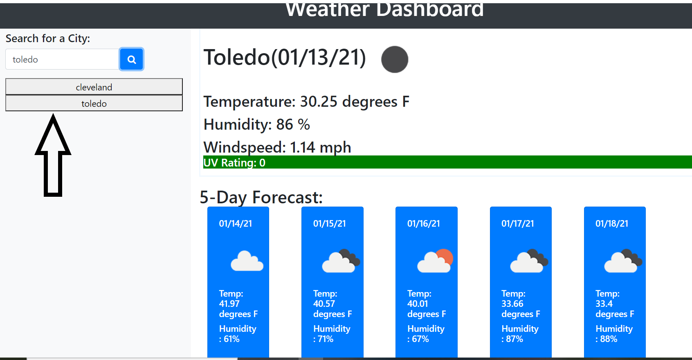

# Weather_Dashboard

Link to Application URL: https://msnow-21.github.io/Weather_Dashboard/

Project Overview: The Weather Dashboard is an application that allows the user to find current the weather information for the city they choose. The Weather Dashboard provides the current weather information in the main screen div, then a 5-Day forecast for that city in the screen below. The current weather information display shows the user the city name, date, temperature, humidity, windspeed, and the UV index. There is also a visual display that shows the user what type of day it will be ex(sunny, cloudy, partly cloudy, rain, or snow). The 5-Day Forecast provides similar information the next five days below the forecast for the day. Visual icons on the 5-Day Forecast Provide the user with the same information of sun, snow, and rain to easily see what weather will be coming in the future. For the user’s convenience, buttons are populated under the search bar for easy access to previously searched cities. Enter in New York, for example, then enter in Los Angeles next. If the user needs to refer to the weather in New York again, they can simply click the button for New York, and the application populates.

The beginning of the application

Entering in a city name

Adding more city names
